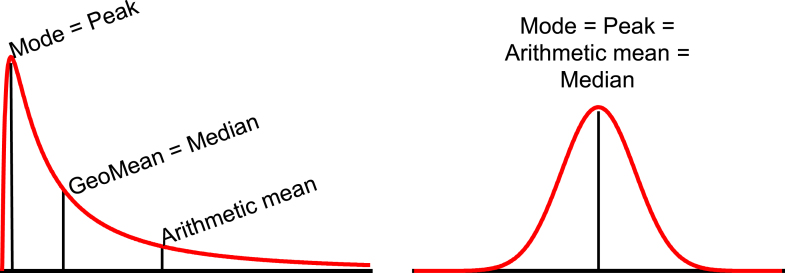
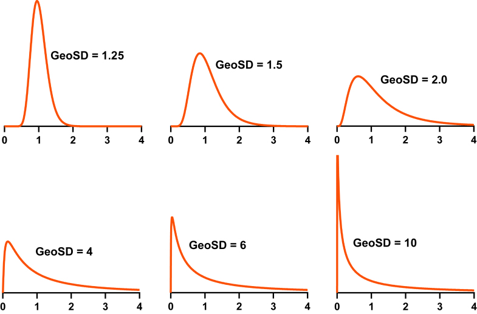
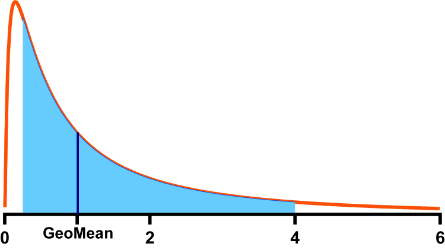

```{r}
#| include: false
# library(appraiseR)
library(MLmetrics)
library(EnvStats)
library(ggplot2)
library(tibble)
library(dplyr)
library(kableExtra)
```

```{r}
#| echo: false
# ==============================================================================
## FUNÇÕES PARA FORMATAÇÃO DE TEXTO
# ==============================================================================

brf <- function(x, decimal.mark = ",", big.mark = ".", digits = 2,
                nsmall = 2, scientific = FALSE, ...) {
  format(x, decimal.mark = decimal.mark, big.mark = big.mark, digits = digits,
         nsmall = nsmall, scientific = scientific, ...)
}


pct <- function (x, ...) {
  if (length(x) == 0)
    return(character())
  x <- brf(100*x, ...)
  paste0(x, "%")
}
```

# Teoria

## Teoria

- @Taleb2025 [79] argumenta contra a utilidade do desvio-padrão ($\sigma$, ou
$\text{RMSE}$) como uma medida de dispersão de uma amostra ou variável aleatória.
  - "Se uma ação com retorno médio igual a zero e **se move, em média, 1% ao 
  dia** (em valores absolutos), com distribuição normal, qual o desvio-padrão
  dos retornos?"
    - R.: 1,25%!

- Enquanto o desvio médio absoluto (MAD) designa algo claro, o desvio-padrão tem
interpretação confusa!
  
- Segundo @Taleb2025 [p. 81], o desvio-padrão predominou na estatística por
apresentar uma eficiência estatística (gaussiana) maior: se os dados tem 
distribuição normal, o desvio-padrão é 12% mais eficiente do que o MAD!

- $\text{MAD}$ é sempre menor do que o desvio-padrão, por conta da 
desigualdade de Jensen [@Taleb2025, 80].


## Teoria

- Segundo @Taleb2025 [85], a razão entre o desvio-padrão $\sigma$ de uma 
variável aleatória com distribuição normal, $X \sim \mathcal N(\mu, \sigma)$, e 
o seu erro médio absoluto, $\text{MAD}$, é igual a:

. . .

$$
\frac{\sigma}{\text{MAD}} = \frac{\sqrt{\mathbb E(X^2)}}{\mathbb E(|X|)} = \sqrt{\frac{\pi}{2}} \approx 1,25
$$ {#eq-STD-MAD}

. . .

- Problema: quando a distribuição não é normal, essa relação muda.
  - Quanto mais grossa a cauda da distribuição dos dados, mais a relação muda
  - Exemplo [@Taleb2025, p. 80]:
    - $X = \{-1, -1, \ldots, -1, 1.000.000\} \;| \; \hat \mu_x = 0$
      - $\hat \sigma_X = 1.000$
      - $\text{MAD}(X) = 2$
      - $\text{STD}/\text{MAD} = 500$
      
## Erros relativos

- O único problema com a escala do MAE é o mesmo que levou @Pearson1896 a 
propor o coeficiente de variação (CV): 

. . . 

```{r}
set.seed(1)
x <- rnorm(n = 1000, mean = 100, sd = 20)
(cv <- sd(x)/mean(x))
```

- Analogamente, o MAE também pode ser dividido pela média amostral, o que gera o
$\text{sMAE}$ (*scaled Mean Absolute Error*):

. . . 


$$
\text{sMAE} = \frac{\text{MAE}}{\bar x}
$$ {#eq-sMAE}


. . . 

```{r}
(smae <- MAE(mean(x), x)/mean(x))
```

- A relação $\hat \sigma/\text{MAE} \approx 1,25$ se mantém para a razão
$\text{CV}/\text{sMAE}$.

. . . 

```{r}
cv/smae
```

```{r}
#| echo: false
#| include: false
smae <- function(actual, predicted) {
  mean(
    Metrics::ae(actual, predicted)
    )/predicted
}
smae(x, mean(x))
```

## Erros relativos

- $\text{sMAE}$ também é conhecido na literatura como *Weighted MAPE*, 
$\text{wMAPE}$:

. . . 


$$
\text{wMAPE} = \frac{\sum_{i=1}^n |A_i - F_i|}{\sum_{i = 1}^n |A_i|}
$$ {#eq-wMAPE}

- Os resultados obtidos com a @eq-wMAPE são idênticos aos obtidos com a @eq-sMAE:

. . . 

```{r}
MAE(mean(x), x)/mean(x)
```
```{r}
sum(Metrics::ae(x, mean(x)))/sum(x)
```

# Exemplos

## Amostra

- Considere-se a amostra abaixo:

. . . 

```{r}
x <- c(125, 200, 250, 300, 375)
```

. . . 

```{r}
mean(x)
```

. . . 

```{r}
median(x)
```

- Os erros de predição, portanto, tanto para a média, como para a mediana, são:

. . . 

```{r}
(erros <- x - 250)
```


## sMAE e MAPE

- O sMAE pode ser visto como um erro percentual, porém sempre em relação ao
estimador de tendência central

- O MAPE, por outro lado, muda a base (denominador) em função do valor do dado
amostral:

. . . 

$$
\text{MAPE} = \frac{1}{n}\sum_{i = 1}^n \left | \frac{A_i - F_i}{A_i} \right |
$$ {#eq-MAPE}

- O MAPE dá muita importância para os valores mais baixos:

. . . 

```{r}
Metrics::ae(x, mean(x))
```

. . . 


```{r}
Metrics::ape(x, mean(x))
```


## sMAE e MAPE

- Para a média:

. . . 

```{r}
MAE(mean(x), x)/mean(x)
```

```{r}
#| echo: false
#| eval: false
smae(x, mean(x))
```


```{r}
MAPE(mean(x), x)
```

- Para outros estimadores (80% de $\hat \mu$):

. . . 

```{r}
MAE(.8*mean(x), x)/(.8*mean(x))
```

```{r}
#| echo: false
#| eval: false
smae(x, .8*mean(x))
```

```{r}
MAPE(.80*mean(x), x)
```

## sMAE e MAPE

- Para a média:

. . . 

```{r}
MAE(mean(x), x)/mean(x)
```

```{r}
MAPE(mean(x), x)
```

- Para outros estimadores (120% de $\hat \mu$):

. . . 

```{r}
MAE(1.20*mean(x), x)/(1.20*mean(x))
```

```{r}
#| echo: false
#| eval: false
smae(x, 1.2*mean(x))
```

```{r}
MAPE(1.20*mean(x), x)
```

- Problema com os erros relativos: podem viesar o melhor estimador!

## A mediana minimiza o MAE

- [Prova](https://statproofbook.github.io/P/med-mae.html)

. . . 

```{r}
#| echo: false
forecasts <- seq(.5, 2, by = .1)*mean(x)
```

```{r}
#| echo: false
mae_values <- sapply(forecasts, MAE, y_true = x)

# 4. Create the plot
plot(forecasts, mae_values, 
     type = "b",          # Both points and lines
     pch = 19,            # Solid circle points
     col = "blue",        # Line color
     xlab = "Valor Previsto", 
     ylab = "MAE",
     main = "MAE vs. Valor Previsto")

# 5. Add a visual anchor for the minimum MAPE point
min_idx <- which.min(mae_values)
abline(v = forecasts[min_idx], col = "red", lty = 2)
```

## A mediana não minimiza o MAPE

```{r}
#| echo: false
mape_values <- sapply(forecasts, MAPE, y_true = x)

# 4. Create the plot
plot(forecasts, mape_values, 
     type = "b",          # Both points and lines
     pch = 19,            # Solid circle points
     col = "blue",        # Line color
     xlab = "Valor Previsto", 
     ylab = "MAPE (%)",
     main = "MAPE vs. Valor Previsto")

# 5. Add a visual anchor for the minimum MAPE point
min_idx <- which.min(mape_values)
abline(v = forecasts[min_idx], col = "red", lty = 2)
```

## E também não minimiza o sMAE 


```{r}
#| echo: false
smae_values <- sapply(forecasts, smae, actual = x)

# 4. Create the plot
plot(forecasts, smae_values, 
     type = "b",          # Both points and lines
     pch = 19,            # Solid circle points
     col = "blue",        # Line color
     xlab = "Valor Previsto", 
     ylab = "sMAE (%)",
     main = "sMAE vs. Valor Previsto")

# 5. Add a visual anchor for the minimum MAPE point
min_idx <- which.min(smae_values)
abline(v = forecasts[min_idx], col = "red", lty = 2)
```


## sMAPE

$$
\text{sMAPE} = \frac{2}{n} \sum_{i=1}^n \frac{ |A_i - F_i|}{|A_i| + |F_i|}
$$ {#eq-sMAPE}

. . . 

```{r}
Metrics::smape(x, mean(x))
```

```{r}
Metrics::smape(x, .8*mean(x))
```

```{r}
Metrics::smape(x, 1.2*mean(x))
```

- o sMAPE parece ser realmente simétrico, ao menos para uma amostra com 
distribuição simétrica!

## sMAPE minimiza a mediana?

```{r}
#| echo: false
smape_values <- sapply(forecasts, Metrics::smape, actual = x)

# 4. Create the plot
plot(forecasts, smape_values, 
     type = "b",          # Both points and lines
     pch = 19,            # Solid circle points
     col = "blue",        # Line color
     xlab = "Valor Previsto", 
     ylab = "sMAPE (%)",
     main = "sMAPE vs. Valor Previsto")

# 5. Add a visual anchor for the minimum MAPE point
min_idx <- which.min(smape_values)
abline(v = forecasts[min_idx], col = "red", lty = 2)
```

- Nada se pode afirmar!

## Alternativas: o MAAPE

- O MAAPE (*Mean Arctangent Absolute Percentage Error*) foi introduzido por
@Kim2016: 

. . . 

$$
\text{MAAPE} = \frac{1}{n}\sum_{i=1}^n \arctan \left ( \left | \frac{A_i - F_i}{A_i} \right | \right)
$$ {#eq-MAAPE}

```{r}
#| echo: false
MAAPE <- function(y_pred, y_true) {
  mean(atan(abs((y_true - y_pred)/y_true)))
}
```

- Segundo @Kim2016[678]: 

  - MAAPE obtain a more balanced penalty between positive and negative 
  errors than MAPE, although the penalty function of MAAPE remains asymmetric
  - MAAPE is also more robust than MAPE due to the bounded influences of outliers
  - MAAPE can be particularly useful when extremely large errors are due to 
  mistaken or incorrect observations.
  

## MAAPE: gráfico
  
```{r}
#| echo: false
maape_values <- sapply(forecasts, MAAPE, y_true = x)

# 4. Create the plot
plot(forecasts, maape_values, 
     type = "b",          # Both points and lines
     pch = 19,            # Solid circle points
     col = "blue",        # Line color
     xlab = "Valor Previsto", 
     ylab = "MAAPE (%)",
     main = "MAAPE vs. Valor Previsto")

# 5. Add a visual anchor for the minimum MAPE point
min_idx <- which.min(maape_values)
abline(v = forecasts[min_idx], col = "red", lty = 2)
```

- Em termos de minimização, não difere muito do MAPE!

# Estudos de Casos

## Com distribuição normal

```{r}
#| echo: false
set.seed(4)
n <- 250
mi <- 500
sigma <- 175
x <- rnorm(n = n, mean = mi, sd = sigma)
me <- mean(x)
med <- median(x)
# mo <- collapse::fmode(x)
mo <- modeest::mlv(x, method = "Parzen")
ma <- mean(x, trim = .10)
```

- Foram gerados dados aleatórios com distribuição $\mathcal N(500, 175^2)$, 
*i.e.*, com $\text{CV} = 35\%$

- Foram calculados para essa amostra média, mediana, moda e média aparada (10%)
  - $\hat\mu =$ `r brf(me)`;
  - $\hat \mu_{1/2} =$ `r brf(med)`;
  - $\hat \mu_0 =$ `r brf(mo)`;
  - $\hat \mu_{tr(10)} =$ `r brf(ma)`;
  - $\hat \sigma =$ `r brf(sd(x))`;
  - $\text{CV} =$ `r brf(sd(x)/mean(x))`
  
- Espera-se que o MAE seja aproximadamente igual a $\sigma/1,25$, *i.e.*, 
$\text{MAE} \approx 140$!
- Espera-se que o sMAE seja aproximadamente igual a $\text{CV}/1,25$, *i.e.*, 
$\text{sMAE} \approx 28\%$!
  
## Dados

```{r}
#| label: fig-normalSample
#| fig-cap: "Amostra aleatória com distribuição normal com média 500 e desvio-padrão 175."
#| echo: false
# hist(x, prob = TRUE, col = "lightblue", 
#     main = "Histograma com Densidade Kernel gaussiana.")
# Add density curve
# lines(density(x), col = "red", lwd = 2)
df <- data.frame(x = x)
df_text <- data.frame(x = 575, y = 0.0025, my_label = "mu == 500")
# Plot histogram plus density
ggplot(df, aes(x = x)) +
  geom_histogram(aes(y = after_stat(density)), 
                 fill = "lightblue", color = "black", bins = 15) +
  geom_density(color = "red", linewidth = 1) +
  scale_x_continuous(limits = c(50, 1000)) +
  geom_vline(aes(xintercept = mi), 
             color = "red", linetype = "dashed", linewidth = 1.2) +
  geom_text(data = df_text, aes(x, y, label = my_label), 
            size = 7, col = "red", parse = TRUE) +
  theme_minimal() 
```
  
## Métricas

```{r}
#| echo: false
metrics <- tribble(
  ~Est., ~MAE, ~sMAE, ~MAPE, ~MAAPE, ~sMAPE, 
  "média", MAE(me, x), smae(x, me), MAPE(me, x), MAAPE(me, x), Metrics::smape(x, me),
  "mediana", MAE(med, x), smae(x, med), MAPE(med, x), MAAPE(med, x), Metrics::smape(x, med),  
  "moda", MAE(mo, x), smae(x, mo), MAPE(mo, x), MAAPE(mo, x), Metrics::smape(x, mo),
  "média aparada (10%)", MAE(ma, x), smae(x, ma), MAPE(ma, x), MAAPE(ma, x), Metrics::smape(x, ma)
)
```

```{r}
#| label: tbl-normalMetrics
#| tbl-cap: "Métricas para os estimadores da amostra normal."
#| echo: false
metrics |>
  mutate(across(where(is.numeric) & !MAE, 
                ~ scales::percent(.x, accuracy = .1,
                                  decimal.mark = ",", big.mark = "."))) |> 
  # mutate(across(where(is.numeric), ~ gsub("\\.", ",", sprintf("%.2f", .x)))) |>
  rowwise() |>
  ungroup() |>
  kable(digits = 2, format.args = list(decimal.mark = ",", big.mark = "."))
```

- MAPE é bem fora de linha!
- Minimiza na moda, que também está bem fora de linha!


## Com distribuição lognormal

- A distribuição lognormal é bem comum na Engenharia de Avaliações!

- Na distribuição lognormal, moda, média e mediana não coincidem, como na 
distribuição normal!

- Para baixos valores de CV na distribuição lognormal (<0,2), quase não se nota
a diferença para a distribuição normal!

. . . 



## Com distribuição lognormal

- Existem conceitos mais conhecidos, como média geométrica, mas poucos conhecem 
o Desvio-Padrão geométrico!

. . . 



## Com distribuição lognormal

- Quanto maior o GeoSD, menos representativos de uma tendência central é a 
moda e a média!

. . . 



## Com distribuição lognormal

```{r}
#| echo: false
set.seed(1)
lmi <- log(470)
lsigma <- .35
lx <- rlnorm3(n, meanlog = lmi, sdlog = lsigma, threshold = 0)
lme <- mean(lx)
lmed <- median(lx)
lmo <- modeest::mlv(lx, method = "Parzen")
lma <- mean(lx, trim = .10)
lcv <- sd(lx)/mean(lx)
```

- Foram gerados dados aleatórios com distribuição lognormal, 
$X \sim \mathcal{LN}(470; 0,35^2)$
  - $\mu_X = 470$
  - $\mathbb E(X) = \exp(\ln(470) + 0,5\cdot 0,35^2) \approx 500$
  - $\text{Mo}(X) = \exp(\ln(470) - 0,35^2) \approx 415$
  - $\text{CV} = \sqrt{e^{\sigma^2} - 1} \approx 36\%$ ($\text{CV} \approx \sigma$)
  - $\text{GeoSD} = e^{\sigma} =$ `r brf(exp(lsigma))`

- Foram calculados para essa amostra média, mediana, moda e média aparada (10%)
  - $\hat\mu =$ `r brf(lme)`;
  - $\hat \mu_{1/2} =$ `r brf(lmed)`;
  - $\hat \mu_0 =$ `r brf(lmo)`;
  - $\hat \mu_{tr(10)} =$ `r brf(lma)`;
  - $\widehat{\text{CV}} =$ `r pct(lcv)`.

## Dados

```{r}
#| label: fig-lognormalSample
#| fig-cap: "Amostra aleatória com distribuição lognormal com mediana 470 e desvio-padrao igual a 0,35 (na escala log)."
#| echo: false
# hist(x)
df <- data.frame(x = lx)
df_text <- data.frame(x = 550, y = 0.003, my_label = "mu == 470")
# Plot histogram plus density
ggplot(df, aes(x = lx)) +
  geom_histogram(aes(y = after_stat(density)), 
                 fill = "lightblue", color = "black",
                 breaks = seq(0, 1200, by = 50)) +
  geom_density(color = "red", linewidth = 1) +
  scale_x_continuous(limits = c(100, 1200)) +
  geom_vline(aes(xintercept = exp(lmi)), 
             color = "red", linetype = "dashed", linewidth = 1.2) +
  geom_text(data = df_text, aes(x, y, label = my_label), 
            size = 7, col = "red", parse = TRUE) +
  theme_minimal()
```


## Métricas

```{r}
#| echo: false
zmetrics <- tribble(
  ~Est., ~MAE, ~sMAE, ~MAPE, ~MAAPE, ~sMAPE, 
  "média", MAE(lme, lx), smae(lx, lme), MAPE(lme, lx), MAAPE(lme, lx), Metrics::smape(lx, lme),
  "mediana", MAE(lmed, lx), smae(lx, lmed), MAPE(lmed, lx), MAAPE(lmed, lx), Metrics::smape(lx, lmed),
  "moda", MAE(lmo, lx), smae(lx, lmo), MAPE(lmo, lx), MAAPE(lmo, lx), Metrics::smape(lx, lmo), 
  "média aparada (10%)", MAE(lma, lx), smae(lx, lma), MAPE(lma, lx), MAAPE(lma, lx), Metrics::smape(lx, lma)
)
```

```{r}
#| label: tbl-lognormalMetrics
#| tbl-cap: "Métricas para os estimadores da amostra lognormal."
#| echo: false
zmetrics |>
  mutate(across(where(is.numeric) & !MAE, 
                ~ scales::percent(.x, accuracy = .1,
                                  decimal.mark = ",", big.mark = "."))) |> 
  # mutate(across(where(is.numeric), ~ gsub("\\.", ",", sprintf("%.2f", .x)))) |>
  rowwise() |>
  ungroup() |>
  kable(digits = 2, format.args = list(decimal.mark = ",", big.mark = "."))
```

- MAPE parece **ok**, porém minimiza a moda!
  - MAAPE também minimiza a moda!
  
- sMAPE minimiza a mediana!

- MAPE, MAAPE e sMAPE tem praticamente as mesmas magnitudes, podendo ser 
utilizadas para interpretação!

## Com distribuição normal (2)

```{r}
#| echo: false
set.seed(4)
n <- 250
mi <- 500
sigma <- 200
x <- rnorm(n = n, mean = mi, sd = sigma)
me <- mean(x)
med <- median(x)
# mo <- collapse::fmode(x)
mo <- modeest::mlv(x, method = "Parzen")
ma <- mean(x, trim = .10)
```

- Foram gerados dados aleatórios com distribuição $\mathcal N(500, 200^2)$, 
*i.e.*, com $\text{CV} = 40\%$

- Foram calculados para essa amostra média, mediana, moda e média aparada (10%)
  - $\hat\mu =$ `r brf(me)`;
  - $\hat \mu_{1/2} =$ `r brf(med)`;
  - $\hat \mu_0 =$ `r brf(mo)`;
  - $\hat \mu_{tr(10)} =$ `r brf(ma)`;
  - $\hat \sigma =$ `r brf(sd(x))`;
  - $\text{CV} =$ `r brf(sd(x)/mean(x))`
  
- Espera-se que o MAE seja aproximadamente igual a $\sigma/1,25$, *i.e.*, 
$\text{MAE} \approx 160$!
- Espera-se que o sMAE seja aproximadamente igual a $\text{CV}/1,25$, *i.e.*, 
$\text{sMAE} \approx 32\%$!
  
## Dados

```{r}
#| label: fig-normalSample2
#| fig-cap: "Amostra aleatória com distribuição normal com média 500 e desvio-padrão 200."
#| echo: false
# hist(x, prob = TRUE, col = "lightblue", 
#     main = "Histograma com Densidade Kernel gaussiana.")
# Add density curve
# lines(density(x), col = "red", lwd = 2)
df <- data.frame(x = x)
df_text <- data.frame(x = 575, y = 0.002, my_label = "mu == 500")
# Plot histogram plus density
ggplot(df, aes(x = x)) +
  geom_histogram(aes(y = after_stat(density)), 
                 fill = "lightblue", color = "black", bins = 15) +
  geom_density(color = "red", linewidth = 1) +
  # scale_x_continuous(limits = c(50, 1000)) +
  geom_vline(aes(xintercept = mi), 
             color = "red", linetype = "dashed", linewidth = 1.2) +
  geom_text(data = df_text, aes(x, y, label = my_label), 
            size = 7, col = "red", parse = TRUE) +
  theme_minimal() 
```
  
## Métricas

```{r}
#| echo: false
metrics <- tribble(
  ~Est., ~MAE, ~sMAE, ~MAPE, ~MAAPE, ~sMAPE, 
  "média", MAE(me, x), smae(x, me), MAPE(me, x), MAAPE(me, x), Metrics::smape(x, me),
  "mediana", MAE(med, x), smae(x, med), MAPE(med, x), MAAPE(med, x), Metrics::smape(x, med),  
  "moda", MAE(mo, x), smae(x, mo), MAPE(mo, x), MAAPE(mo, x), Metrics::smape(x, mo),
  "média aparada (10%)", MAE(ma, x), smae(x, ma), MAPE(ma, x), MAAPE(ma, x), Metrics::smape(x, ma)
)
```

```{r}
#| label: tbl-normalMetrics2
#| tbl-cap: "Métricas para os estimadores da amostra normal."
#| echo: false
metrics |>
  mutate(across(where(is.numeric) & !MAE, 
                ~ scales::percent(.x, accuracy = .1,
                                  decimal.mark = ",", big.mark = "."))) |> 
  # mutate(across(where(is.numeric), ~ gsub("\\.", ",", sprintf("%.2f", .x)))) |>
  rowwise() |>
  ungroup() |>
  kable(digits = 2, format.args = list(decimal.mark = ",", big.mark = "."))
```

- MAPE explode!
- Minimiza na moda, que também está bem fora de linha!
- Não significa absolutamente nada!

## Com distribuição lognormal (2)

```{r}
#| echo: false
set.seed(1)
lmi2 <- log(470)
lsigma2 <- .70
lx2 <- rlnorm3(n, meanlog = lmi2, sdlog = lsigma2, threshold = 0)
lme2 <- mean(lx2)
lmed2 <- median(lx2)
lmo2 <- modeest::mlv(lx2, method = "Parzen")
lma2 <- mean(lx2, trim = .10)
lcv2 <- sd(lx2)/mean(lx2)
```

- Foram gerados dados aleatórios com distribuição lognormal, 
$X \sim \mathcal{LN}(470; 0,70^2)$
  - $\mu_X = 470$
  - $\mathbb E(X) = \exp(\ln(470) + 0,5\cdot 0,70^2) \approx 600$
  - $\text{Mo}(X) = \exp(\ln(470) - 0,70^2) \approx 300$
  - $\text{CV} = \sqrt{e^{\sigma^2} - 1} \approx 80\%$
  - $\text{GeoSD} = e^{\sigma} =$ `r brf(exp(lsigma2))`
  
- Foram calculados para essa amostra média, mediana, moda e média aparada (10%)
  - $\hat\mu =$ `r brf(lme2)`;
  - $\hat \mu_{1/2} =$ `r brf(lmed2)`;
  - $\hat \mu_0 =$ `r brf(lmo2)`;
  - $\hat \mu_{tr(10)} =$ `r brf(lma2)`;
  - $\widehat{\text{CV}} =$ `r pct(lcv2)`.

## Dados

```{r}
#| label: fig-lognormalSample2
#| fig-cap: "Amostra aleatória com distribuição lognormal com mediana 470 e desvio-padrao igual a 0,70 (na escala log)."
#| echo: false
# hist(x)
df2 <- data.frame(x = lx2)
df_text <- data.frame(x = 650, y = 0.00175, my_label = "mu == 470")
# Plot histogram plus density
ggplot(df2, aes(x = lx2)) +
  geom_histogram(aes(y = after_stat(density)), 
                 fill = "lightblue", color = "black", bw = 100
                 # breaks = seq(0, 1200, by = 50)
                 ) +
  geom_density(color = "red", linewidth = 1) +
  scale_x_continuous(limits = c(0, 3000)) +
  geom_vline(aes(xintercept = exp(lmi2)), 
             color = "red", linetype = "dashed", linewidth = 1.2) +
  geom_text(data = df_text, aes(x, y, label = my_label), 
            size = 7, col = "red", parse = TRUE) +
  theme_minimal()
```


## Métricas

```{r}
#| echo: false
zmetrics <- tribble(
  ~Est., ~MAE, ~sMAE, ~MAPE, ~MAAPE, ~sMAPE, 
  "média", MAE(lme2, lx2), smae(lx2, lme2), MAPE(lme2, lx2), MAAPE(lme2, lx2), Metrics::smape(lx2, lme2),
  "mediana", MAE(lmed2, lx2), smae(lx2, lmed2), MAPE(lmed2, lx2), MAAPE(lmed2, lx2), Metrics::smape(lx2, lmed2),
  "moda", MAE(lmo2, lx2), smae(lx2, lmo2), MAPE(lmo2, lx2), MAAPE(lmo2, lx2), Metrics::smape(lx2, lmo2), 
  "média aparada (10%)", MAE(lma2, lx2), smae(lx2, lma2), MAPE(lma2, lx2), MAAPE(lma2, lx2), Metrics::smape(lx2, lma2)
)
```

```{r}
#| label: tbl-lognormalMetrics2
#| tbl-cap: "Métricas para os estimadores da amostra lognormal (2)."
#| echo: false
zmetrics |>
  mutate(across(where(is.numeric) & !MAE, 
                ~ scales::percent(.x, accuracy = .1,
                                  decimal.mark = ",", big.mark = "."))) |> 
  # mutate(across(where(is.numeric), ~ gsub("\\.", ",", sprintf("%.2f", .x)))) |>
  rowwise() |>
  ungroup() |>
  kable(digits = 2, format.args = list(decimal.mark = ",", big.mark = "."))
```

- MAPE parece **ok** para a moda!
  - MAAPE também minimiza a moda!
  
- sMAPE minimiza a mediana!

- MAAPE e sMAPE mais estáveis entre as medidas!

## Com distribuição normal contaminada

```{r}
#| echo: false
set.seed(1)

# Generate 250 points 
# p.mix represents the proportion belonging to the FIRST distribution
z <- rnormMix(n = n, 
              mean1 = mi, sd1 = sigma,          # Good data
              mean2 = 2*mi, sd2 = 2*sigma,      # Contaminated data
              p.mix = 0.10)                     # 90% good, 10% contaminated
zme <- mean(z)
zmed <- median(z)
zmo <- modeest::mlv(z, method = "Parzen")
zma <- mean(z, trim = .10)
```

- Foram gerados dados aleatórios com distribuição $\mathcal N(500, 200)$, mais
20% de dados contaminantes, com distribuição $\mathcal N(500, 400)$

- Foram calculados para essa amostra média, mediana, moda e média aparada (10%)
  - $\hat\mu =$ `r brf(zme)`;
  - $\hat \mu_{1/2} =$ `r brf(zmed)`;
  - $\hat \mu_0 =$ `r brf(zmo)`;
  - $\hat \mu_{tr(10)} =$ `r brf(zma)`.
  
## Dados

```{r}
#| label: fig-CnormalSample
#| fig-cap: "Amostra aleatória com distribuição normal contaminada."
#| echo: false
# hist(x, prob = TRUE, col = "lightblue", 
#     main = "Histograma com Densidade Kernel gaussiana.")
# Add density curve
# lines(density(x), col = "red", lwd = 2)
df <- data.frame(x = z)
df_text <- data.frame(x = 645, y = 0.00175, my_label = "mu == 500")
# Plot histogram plus density
ggplot(df, aes(x = x)) +
  geom_histogram(aes(y = after_stat(density)), 
                 fill = "lightblue", color = "black", bins = 15) +
  geom_density(color = "red", linewidth = 1) +
  geom_vline(aes(xintercept = mi), 
             color = "red", linetype = "dashed", linewidth = 1.2) +
  geom_text(data = df_text, aes(x, y, label = my_label), 
            size = 7, col = "red", parse = TRUE) +
  theme_minimal() 
```
  
## Métricas
  
```{r}
#| echo: false
zmetrics <- tribble(
  ~Est., ~MAE, ~sMAE, ~MAPE, ~MdAPE, ~MAAPE, ~sMAPE, 
  "média", MAE(zme, z), smae(z, zme), MAPE(zme, z), MedianAPE(zme, z), MAAPE(zme, z), Metrics::smape(z, zme),
  "mediana", MAE(zmed, z), smae(z, zmed), MAPE(zmed, z), MedianAPE(zmed, z), MAAPE(zmed, z), Metrics::smape(z, zmed),  
  "moda", MAE(zmo, z), smae(z, zmo), MAPE(zmo, z), MedianAPE(zmo, z), MAAPE(zmo, z), Metrics::smape(z, zmo),
  "média aparada (10%)", MAE(zma, z), smae(z, zma), MAPE(zma, z), MedianAPE(zma, z), MAAPE(zma, z), Metrics::smape(z, zma)
)
```

```{r}
#| label: tbl-CnormalMetrics
#| tbl-cap: "Métricas para os estimadores da amostra normal."
#| echo: false
zmetrics |>
  mutate(across(where(is.numeric) & !MAE, 
                ~ scales::percent(.x, accuracy = .1,
                                  decimal.mark = ",", big.mark = "."))) |> 
  # mutate(across(where(is.numeric), ~ gsub("\\.", ",", sprintf("%.2f", .x)))) |>
  rowwise() |>
  ungroup() |>
  kable(digits = 2, format.args = list(decimal.mark = ",", big.mark = "."))
```

- MAPE totalmente fora de linha!

- MdAPE (*Median Absolute Percentage Error*) mostrou-se adequado!

- sMAPE pareceu um pouco inflado, porém não ficou muito fora de linha

# Considerações Finais

## Conclusão

- O MAPE parece ser uma métrica adequada apenas quando os dados se apresentam em
distribuição lognormal
  - Com distribuição lognormal, minimizar o MAPE significa buscar a moda da
  distribuição

- Com outras distribuições, o MAPE parece bem fora de linha

- Há outras métricas mais interessantes, como o MAAPE e o sMAPE

- O MAAPE mostrou-se mais resistente à *outliers*

- MAAPE parece ter uma ordem de grandeza mais representativa da dispersão dos
erros!

## Referências